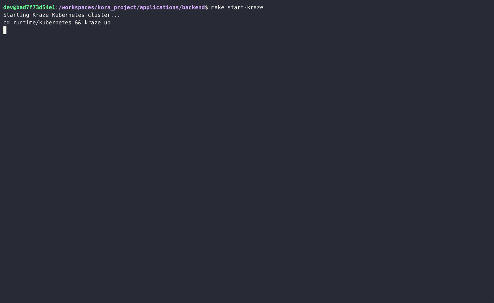

# kraze

> Bring the simplicity of docker-compose to Kubernetes local development

## Table of Contents

- [Description](#description)
- [Demo](#demo)
- [Installation](#installation)
  - [Prerequisites](#prerequisites)
  - [Build from Source](#build-from-source)
  - [Shell Completion](#shell-completion)
- [Quick Start](#quick-start)
- [Usage](#usage)
  - [Commands](#commands)
    - [`kraze up [services...]`](#kraze-up-services)
    - [`kraze down [services...]`](#kraze-down-services)
    - [`kraze status`](#kraze-status)
    - [`kraze init`](#kraze-init)
    - [`kraze destroy`](#kraze-destroy)
    - [`kraze validate`](#kraze-validate)
    - [`kraze load-image <image...>`](#kraze-load-image-image)
    - [`kraze version`](#kraze-version)
    - [`kraze completion [bash|zsh|fish|powershell]`](#kraze-completion-bashzshfishpowershell)
  - [Configuration File Reference](#configuration-file-reference)
  - [Environment Variables](#environment-variables)
  - [Global Flags](#global-flags)
- [Examples](#examples)
- [Development](#development)
- [License](#license)
- [Contributing](#contributing)

## Description

kraze is a Kubernetes development environment manager that brings the familiar docker-compose developer experience to local Kubernetes development. It manages kind (Kubernetes in Docker) clusters and orchestrates the installation, upgrade, and removal of services defined in a simple, declarative YAML configuration file.

**Key Features:**
- **Simple YAML Configuration** - Define your entire development environment in one file
- **Automatic Cluster Management** - Creates and configures kind clusters automatically
- **Helm & Manifest Support** - Deploy Helm charts and raw Kubernetes manifests
- **Dependency Resolution** - Services are installed in the correct order based on dependencies
- **Clean Teardown** - Removes all resources including CRDS, namespaces, and PVCs
- **State Management** - Tracks what's installed to enable incremental updates
- **docker-compose UX** - Familiar commands: `up`, `down`, `status`

## Demo

Watch kraze orchestrate a full microservices stack with dependencies, Helm charts, and custom manifests:



The interactive UI shows real-time progress with:
- **Live status updates** - All services visible at once with in-place updates
- **Animated spinners** - Visual feedback during installation and resource loading
- **Dependency ordering** - Services start automatically in the correct sequence
- **Clean output** - No scrolling clutter, just clear status for each service

> **Tip:** Use `--plain` for traditional scrolling output or `-v` for detailed verbose logging.

## Installation

### Prerequisites

- **Docker** - Docker Desktop or Docker Engine must be running
- **Go 1.25+** - Required to build from source

### Build from Source

```bash
# Clone the repository
git clone https://github.com/hjames9/kraze.git
cd kraze

# Build the binary
make build

# The binary will be in ./build/kraze
./build/kraze --help

# Optional: Install to system path
make install
```

### Shell Completion

kraze supports shell completion for bash, zsh, fish, and PowerShell.

**Bash:**
```bash
# Load completion for current session
source <(kraze completion bash)

# Install permanently (Linux)
kraze completion bash | sudo tee /etc/bash_completion.d/kraze

# Install permanently (macOS with Homebrew)
kraze completion bash > $(brew --prefix)/etc/bash_completion.d/kraze
```

**Zsh:**
```bash
# Enable completion if not already enabled
echo "autoload -U compinit; compinit" >> ~/.zshrc

# Install completion
mkdir -p ~/.zsh/completions
kraze completion zsh > ~/.zsh/completions/_kraze

# Add to .zshrc if not present
echo 'fpath=(~/.zsh/completions $fpath)' >> ~/.zshrc

# Restart shell or reload
source ~/.zshrc
```

**Fish:**
```bash
# Install completion
mkdir -p ~/.config/fish/completions
kraze completion fish > ~/.config/fish/completions/kraze.fish
```

**PowerShell:**
```powershell
# Load for current session
kraze completion powershell | Out-String | Invoke-Expression

# Add to profile for all sessions
kraze completion powershell >> $PROFILE
```

## Quick Start

Create a `kraze.yml` file in your project:

```yaml
cluster:
  name: dev-cluster
  version: "1.34.0"
  config:
    - role: control-plane
      extraPortMappings:
        - containerPort: 30080
          hostPort: 8080
          protocol: TCP

services:
  # Deploy Redis from Helm chart
  redis:
    type: helm
    repo: oci://registry-1.docker.io/bitnamicharts
    chart: redis
    namespace: data
    create_namespace: true

  # Deploy PostgreSQL from Helm chart
  postgres:
    type: helm
    repo: oci://registry-1.docker.io/bitnamicharts
    chart: postgresql
    version: 18.1.9
    namespace: data
    create_namespace: true

  # Deploy custom app from Kubernetes manifests
  myapp:
    type: manifests
    path: ./k8s/manifests
    namespace: app
    depends_on:
      - redis
      - postgres
```

Run your environment:

```bash
# Start everything (creates cluster + installs services)
kraze up

# Check status
kraze status

# Output:
# Cluster: dev-cluster
#
# SERVICE    TYPE         INSTALLED  READY      MESSAGE
# --------------------------------------------------------------------------------
# redis      helm         Yes        Yes        deployed
# postgres   helm         Yes        Yes        deployed
# myapp      manifests    Yes        Yes        3 resources applied

# Stop and clean up everything
kraze down

# Destroy the cluster
kraze destroy
```

## Usage

### Commands

#### `kraze up [services...]`
Install and start services defined in kraze.yml. If no services are specified, all services are started.

```bash
# Start all services
kraze up

# Start specific services
kraze up redis postgres

# Use a different config file
kraze up -f dev.yml

# Wait for resources to be ready
kraze up --wait --timeout 5m

# See what would happen without executing
kraze up --dry-run
```

#### `kraze down [services...]`
Uninstall services. Automatically cleans up namespaces and PVCs that were created.

```bash
# Stop all services
kraze down

# Stop specific services
kraze down myapp

# Keep Custom Resource Definitions (CRDs)
kraze down --keep-crds
```

#### `kraze status`
Show the current status of all services.

```bash
kraze status

# Verbose output
kraze status -v
```

#### `kraze init`
Create and initialize a new kind cluster.

```bash
kraze init

# Use custom config
kraze init -f kraze.yml
```

#### `kraze destroy`
Delete the kind cluster and clean up all resources.

```bash
kraze destroy

# Use custom config
kraze destroy -f kraze.yml
```

#### `kraze validate`
Validate your kraze.yml configuration file.

```bash
kraze validate

# Validate specific file
kraze validate -f dev.yml
```

#### `kraze load-image <image...>`
Load local Docker images into the kind cluster.

```bash
# Load one or more images
kraze load-image myapp:latest myworker:v1.0

# Useful for local development workflow
docker build -t myapp:dev .
kraze load-image myapp:dev
kubectl rollout restart deployment/myapp
```

#### `kraze version`
Display version information.

```bash
kraze version
```

#### `kraze completion [bash|zsh|fish|powershell]`
Generate shell completion scripts.

```bash
# Bash
kraze completion bash > /etc/bash_completion.d/kraze

# Zsh
kraze completion zsh > ~/.zsh/completions/_kraze

# Fish
kraze completion fish > ~/.config/fish/completions/kraze.fish

# PowerShell
kraze completion powershell >> $PROFILE
```

See [Shell Completion](#shell-completion) section for detailed installation instructions.

### Configuration File Reference

The `kraze.yml` file defines your cluster and services:

```yaml
# Cluster configuration
cluster:
  name: my-cluster                    # Name of the kind cluster
  version: "1.34.0"                   # Kubernetes version (optional)
  config:                             # kind cluster configuration
    - role: control-plane
      extraPortMappings:              # Expose ports from cluster
        - containerPort: 30080
          hostPort: 8080
          protocol: TCP

  # Optional: Use existing cluster (Docker Desktop, Minikube, remote)
  # external:
  #   enabled: true
  #   kubeconfig: ~/.kube/config      # Optional - default: ~/.kube/config
  #   context: docker-desktop         # Optional - default: current-context

# Services to deploy
services:
  # Helm chart from OCI registry
  service-name:
    type: helm
    repo: oci://registry-1.docker.io/bitnamicharts
    chart: redis
    version: 23.2.6              # Optional - defaults to latest
    namespace: data
    create_namespace: true       # Defaults to true
    values: values.yml           # Single values file
    # OR multiple values files (merged in order, later overrides earlier):
    # values:
    #   - base-values.yml
    #   - prod-values.yml
    depends_on:                  # Optional - list of dependencies
      - other-service
    wait: true                   # Wait for resources to be ready (defaults to CLI flag)
    wait_timeout: "15m"          # Timeout for wait operations (defaults to CLI timeout)
    post_ready_delay: "5s"       # Delay after service is ready before continuing (defaults to 3s)

  # Helm chart from HTTP repository
  another-service:
    type: helm
    repo: https://charts.bitnami.com/bitnami
    chart: postgresql
    namespace: database

  # Local Helm chart
  local-chart:
    type: helm
    path: ./charts/myapp        # Path to local chart directory
    namespace: app

  # Kubernetes manifests
  manifest-service:
    type: manifests
    path: ./k8s                 # Directory or single YAML file
    namespace: app
    depends_on:
      - service-name
```

### Environment Variables

You can use environment variable substitution in your configuration:

```yaml
services:
  myapp:
    type: helm
    repo: ${HELM_REPO:-https://charts.bitnami.com/bitnami}
    chart: ${APP_CHART:-redis}
    namespace: ${NAMESPACE:-default}
```

### Wait Behavior and Dependencies

kraze automatically handles service dependencies and ensures services are ready before starting dependent services.

#### CLI Flags

- `--wait` (default: `true`) - Wait for all resources to be ready before proceeding
- `--no-wait` - Skip waiting for resources to be ready
- `--timeout <duration>` (default: `10m`) - Global timeout for wait operations

#### Per-Service Configuration

You can override wait behavior for individual services:

```yaml
services:
  rabbitmq:
    type: helm
    chart: rabbitmq
    repo: oci://registry-1.docker.io/bitnamicharts
    namespace: messaging
    wait: true           # Ensure RabbitMQ is fully ready
    wait_timeout: "15m"  # Give it 15 minutes to start

  rabbitmq-migrator:
    type: helm
    chart: ./migrations
    namespace: messaging
    depends_on:
      - rabbitmq         # Will only start after rabbitmq is ready
    wait_timeout: "5m"   # Migrations are usually quick
```

**Configuration Precedence:**
1. Service-specific `wait` and `wait_timeout` (highest priority)
2. CLI flags `--wait`, `--timeout`
3. Defaults: `wait=true`, `timeout="10m"`

**What "ready" means:**

*For Helm charts:*
- Helm's built-in wait functionality monitors all resources
- Deployments: `status.availableReplicas == spec.replicas`
- StatefulSets: `status.readyReplicas == spec.replicas`
- DaemonSets: `status.numberReady == status.desiredNumberScheduled`
- Jobs: `status.succeeded > 0` or conditions show Complete
- All readiness probes must pass

*For Manifests:*
- kraze polls each applied resource until ready
- Same readiness checks as Helm
- For CRDs (like RabbitmqCluster): Checks `status.conditions` for Ready=True
- Polls every 2 seconds until ready or timeout

**Example workflow:**
```bash
# Use defaults (wait=true, timeout=10m)
kraze up

# Override globally
kraze up --wait --timeout 20m

# Skip waiting entirely (fast but risky)
kraze up --no-wait
```

### Global Flags

- `-f, --file` - Path to configuration file (default: `kraze.yml`)
- `-v, --verbose` - Enable verbose output
- `--dry-run` - Show what would happen without executing

## Examples

See the [examples/](./examples) directory for complete working examples:

- **[minimal/](./examples/minimal)** - Simplest possible configuration (single service)
- **[charts/](./examples/charts)** - All Helm chart sources (OCI, HTTPS, local)
- **[manifests/](./examples/manifests)** - All manifest sources (local files, directories, remote URLs)
- **[dependencies/](./examples/dependencies)** - Multi-service with dependency management
- **[external-cluster/](./examples/external-cluster)** - Use existing clusters (Docker Desktop, Minikube, remote)
- **[labels/](./examples/labels)** - Filter services by labels (env, tier, team)

Validate all examples:
```bash
make validate-examples   # CLI validation (integration test)
make test                # Includes example unit tests
```

## Development

```bash
# Install dependencies
make deps

# Build
make build

# Run tests
make test

# Format code
make fmt

# Run linter
make lint

# Clean build artifacts
make clean
```

## License

Apache License 2.0 - see [LICENSE](LICENSE) for details

## Contributing

Contributions are welcome! Please feel free to submit a Pull Request.
